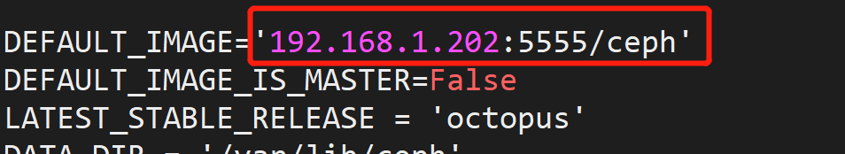
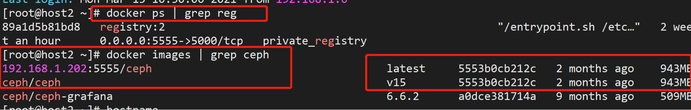

* [1、环境搭建](#1%E7%8E%AF%E5%A2%83%E6%90%AD%E5%BB%BA)
    * [1\.1  拷贝文件到四台机器](#11--%E6%8B%B7%E8%B4%9D%E6%96%87%E4%BB%B6%E5%88%B0%E5%9B%9B%E5%8F%B0%E6%9C%BA%E5%99%A8)
    * [1\.2 复制到根目录](#12-%E5%A4%8D%E5%88%B6%E5%88%B0%E6%A0%B9%E7%9B%AE%E5%BD%95)
    * [1\.3 配置源](#13-%E9%85%8D%E7%BD%AE%E6%BA%90)
    * [1\.4 用cephadm脚本安装](#14-%E7%94%A8cephadm%E8%84%9A%E6%9C%AC%E5%AE%89%E8%A3%85)
    * [1\.5 安装命令行工具](#15-%E5%AE%89%E8%A3%85%E5%91%BD%E4%BB%A4%E8%A1%8C%E5%B7%A5%E5%85%B7)
    * [1\.6  创建ceph配置⽂件⽬录](#16--%E5%88%9B%E5%BB%BAceph%E9%85%8D%E7%BD%AE%E4%BB%B6%E5%BD%95)
    * [1\.7  修改cephadm文件](#17--%E4%BF%AE%E6%94%B9cephadm%E6%96%87%E4%BB%B6)
    * [1\.8  启动第一个mon节点，设置无密码登录](#18--%E5%90%AF%E5%8A%A8%E7%AC%AC%E4%B8%80%E4%B8%AAmon%E8%8A%82%E7%82%B9%E8%AE%BE%E7%BD%AE%E6%97%A0%E5%AF%86%E7%A0%81%E7%99%BB%E5%BD%95)
    * [1\.9 添加节点](#19-%E6%B7%BB%E5%8A%A0%E8%8A%82%E7%82%B9)
    * [1\.11 设置public⽹络的⽹段](#111-%E8%AE%BE%E7%BD%AEpublic%E7%BB%9C%E7%9A%84%E6%AE%B5)
    * [1\.12  打标签](#112--%E6%89%93%E6%A0%87%E7%AD%BE)
    * [1\.13  查看可用盘](#113--%E6%9F%A5%E7%9C%8B%E5%8F%AF%E7%94%A8%E7%9B%98)
    * [1\.1 4 添加osd](#11-4-%E6%B7%BB%E5%8A%A0osd)
    * [1\.15 创建pool](#115-%E5%88%9B%E5%BB%BApool)
    * [1\.16   创建cloudadmin用户](#116---%E5%88%9B%E5%BB%BAcloudadmin%E7%94%A8%E6%88%B7)
    * [1\.17 最后执行](#117-%E6%9C%80%E5%90%8E%E6%89%A7%E8%A1%8C)
# 1、环境搭建

  [参考链接](https://blog.csdn.net/get_set/article/details/108092248)

###      1.1  拷贝文件到四台机器

```
[root@host2 rpms]# scp cephadm 192.168.1.204:/root
root@192.168.1.204's password:
cephadm                                                             100%  214KB  10.0MB/s   00:00
[root@host2 rpms]# scp cephadm 192.168.1.207:/root
root@192.168.1.207's password:
cephadm                                                             100%  214KB  58.4MB/s   00:00
[root@host2 rpms]# scp cephadm 192.168.1.208:/root
root@192.168.1.208's password:
cephadm                                                             100%  214KB  10.2MB/s   00:00
[root@host2 rpms]# scp cephadm 192.168.1.209:/root
root@192.168.1.209's password:
cephadm                
```

也可以直接从网上get最新的cephadm,这个有离线包就不要执行了。

```
curl --silent --remote-name --location https://github.com/ceph/ceph/raw/octopus/src/cephadm/cephadm
chmod +x cephadm
```

###    1.2 复制到根目录

```
cp cephadm /usr/bin
chmod +x /usr/bin/cephadm
```

### 1.3 配置源

```
yum install -y https://mirrors.aliyun.com/epel/epel-release-latest-8.noarch.rpm
sed -i 's|^#baseurl=https://download.fedoraproject.org/pub|baseurl=https://mirrors.aliyun.com|' /etc/yum.repos.d/epel*
sed -i 's|^metalink|#metalink|' /etc/yum.repos.d/epel*
```

###   1.4 用cephadm脚本安装

​    前提要有py3，docker，卸载pod【docker和podman用一个，我们用docker】。由于使用的是openstack虚拟机，官方的qcow2镜像，里面少很多东西,，所以要手动安装。

  ```
# 下面命令是因为缺才装的，如果系统本身就有,可以不用执行。
rpm -e podman podman-catatonit cockpit-podman  
yum install python3
yum install wget
# docker 安装参考openstack搭建
  ```

 ```
cephadm add-repo --release octopus
cephadm install
 ```

​        将ceph.tar传到存储节点，导入docker镜像（在线的不需要执行这一步了）

修改配置文件:

```
[root@os1 ~]# vi /usr/sbin/cephadm
[root@os1 ~]# vi /etc/docker/daemon.json
```

```
 "insecure-registries":["192.168.10.11:5555"]
 192.168.10.11:5555/ceph
```

>  上面是根据离线的情况改的。在线的话就不要改了,离线要有本地仓库。

```
[root@os2 ~]# systemctl daemon-reload
[root@os2 ~]# systemctl restart docker
```

### 1.5 安装命令行工具

> 尽量用这个命令！

```shell
cephadm install ceph-common
```

  时间有点长，容易超时，也可以按照下面方式安装（尽量别用）

```
sed -i 's#download.ceph.com#mirrors.aliyun.com/ceph#' /etc/yum.repos.d/ceph.repo
dnf makecache
```

```
dnf install -y ceph-common
ceph -v
ceph -s
```

### 1.6  创建ceph配置⽂件⽬录

```
mkdir -p /etc/ceph
```

### 1.7  修改cephadm文件

> 在线安装这一步不需要执行

```
vi /usr/sbin/cephadm
```

 修改第一行，这个要根据具体的来改





### 1.8  启动第一个mon节点，设置无密码登录

> 重要，这条命令做了很多操作

```
cephadm bootstrap --mon-ip 192.168.218.35
```

> 在0上执行, 做⽆密码登录,0本身也要做，不然后面会报错

```
ssh-copy-id -f -i /etc/ceph/ceph.pub  centos8-openstack-1
ssh-copy-id -f -i /etc/ceph/ceph.pub  centos8-openstack-2
ssh-copy-id -f -i /etc/ceph/ceph.pub  centos8-openstack-3
```

### 1.9 添加节点

> 一体机的话加一个就可以了

```
ceph orch host add centos8-openstack-1
ceph orch host add centos8-openstack-2
ceph orch host add centos8-openstack-3
```

### 1.11 设置public⽹络的⽹段

 在0上执行，这是管理网络。存储网络不在这里设置，是在ceph.conf里设置的。

```
ceph config set mon public_network 192.168.218.0/24
```

### 1.12  打标签

> 一体机的话加一个就可以了。

```shell
[root@centos8-openstack-0 ~]# ceph orch host label add centos8-openstack-0  mon
Added label mon to host centos8-openstack-0
[root@centos8-openstack-0 ~]# ceph orch host label add centos8-openstack-1  mon
Added label mon to host centos8-openstack-1
[root@centos8-openstack-0 ~]# ceph orch host label add centos8-openstack-2  mon
Added label mon to host centos8-openstack-2
[root@centos8-openstack-0 ~]# ceph orch host label add centos8-openstack-3  mon
Added label mon to host centos8-openstack-3
[root@centos8-openstack-0 ~]# ceph orch apply mon label:mon
Scheduled mon update...
```

```shell
# 查看标签情况
[root@centos8-openstack-0 ~]# ceph orch host ls
HOST                 ADDR                 LABELS  STATUS
centos8-openstack-0  centos8-openstack-0  mon
centos8-openstack-1  centos8-openstack-1  mon
centos8-openstack-2  centos8-openstack-2  mon
centos8-openstack-3  centos8-openstack-3  mon
```

注意：mon节点应该是奇数

### 1.13  查看可用盘

```
[root@centos8-openstack-0 ~]# ceph orch device ls
Hostname             Path      Type  Serial                Size   Health   Ident  Fault  Available
centos8-openstack-0  /dev/vdb  hdd   c14d280c-f837-4e58-9   107G  Unknown  N/A    N/A    Yes
centos8-openstack-1  /dev/vdb  hdd   ad67926d-7dcc-494c-b   107G  Unknown  N/A    N/A    Yes
centos8-openstack-2  /dev/vdb  hdd   c815a3ff-d3f9-47ff-a   107G  Unknown  N/A    N/A    Yes
centos8-openstack-3  /dev/vdb  hdd   1e930ba0-5d1a-404f-9   107G  Unknown  N/A    N/A    Yes
```

如果只看到了一台，或者看不到，或者添加osd直接报错了，就要初始化磁盘

```
 ceph orch device zap centos8-openstack-0  /dev/vdb --force
 ceph orch device zap centos8-openstack-1  /dev/vdb --force
 ceph orch device zap centos8-openstack-2  /dev/vdb --force
 ceph orch device zap centos8-openstack-3  /dev/vdb --force
```

格式化磁盘报错busy的解决方法：

```
dmsetup ls --tree
dmsetup remove ceph--d317f43e--120c--4fb5--a89f--2b13d38dd464-osd--block--e890821b--410d--406c--a28d--cffb37643444
```

当然，网上也有格式化，然后reboot服务器的方法

### 1.1 4 添加osd

> 一体机需要加三块盘，主机名同，盘不同！多节点根据实际主机名和盘名称来修改下面命令！

```
[root@centos8-openstack-0 ~]# ceph orch daemon add osd centos8-openstack-0:/dev/vdb
Created osd(s) 0 on host 'centos8-openstack-0'
[root@centos8-openstack-0 ~]# ceph orch daemon add osd centos8-openstack-1:/dev/vdb
Created osd(s) 1 on host 'centos8-openstack-1'
[root@centos8-openstack-0 ~]# ceph orch daemon add osd centos8-openstack-2:/dev/vdb
Created osd(s) 2 on host 'centos8-openstack-2'
[root@centos8-openstack-0 ~]# ceph orch daemon add osd centos8-openstack-3:/dev/vdb
Created osd(s) 3 on host 'centos8-openstack-3'
```

 遇到过一次添加osd报时间相关服务的问题，卸载chrony服务，重装解决。

### 1.15 创建pool

> 按照这个来，后面写openstack的globals.yml会用到
>
> 如果osd数量比较少，就三块，命令中的64可以改小一点。改成8，16之类的，否则可能会报错。

```
ceph osd pool create vms 64 64
ceph osd pool create images 64 64
ceph osd pool create volumes 64 64
ceph osd pool create backups 64 64
ceph osd pool create gnocchi 64 64
```

   注意，可能会出现创建不了，具体是pgs超过了最大限制数。并且改小了创建时候，改成了8，使用的时候还是报错，只能手动改了。


```
# 上面的卷都要改
ceph osd pool set volumes size 1
ceph osd pool set volumes min_size 1
```

修改好等它自己自动修复

修复后的状态，依然有一个不正常，不过这个时候已经可以正常上传镜像了，暂时不影响使用。

[解决方法参考链接](https://blog.csdn.net/don_chiang709/article/details/91511828)

[pgs计算方式](https://ceph.com/pgcalc/)

### 1.16   创建cloudadmin用户

>  创建 cloudadmin ⽤户，⽤于 openstack 组件的认证，名称要一样。注意不要换行。

```
ceph auth get-or-create client.cloudadmin mon 'allow r' osd 'allow class-read object_prefix rbd_children, allow rwx pool=ceph-sata, allow rwx pool=volumes, allow rwx pool=gnocchi, allow rwx pool=vms, allow rwx
pool=backups, allow rwx pool=images' -o /etc/ceph/ceph.client.cloudadmin.keyring
```

### 1.17 最后执行

​      修改docker.service 文件后没有重启ceph，导致ceph集群有问题。可以手动执行下面命令，确保ceph -s 查到的ceph集群状态是正常的（actice+clean）。否则访问opentack镜像这一块的时候会报错！

   ```
systemctl start ceph.target
docker ps --all|grep ceph
   ```

​       

