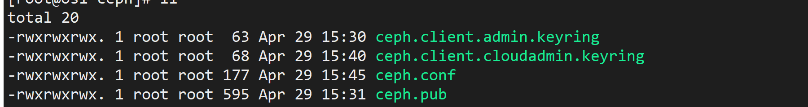

* [1、前提条件](#1%E5%89%8D%E6%8F%90%E6%9D%A1%E4%BB%B6)
* [2、设置域名解析和免密登录](#2%E8%AE%BE%E7%BD%AE%E5%9F%9F%E5%90%8D%E8%A7%A3%E6%9E%90%E5%92%8C%E5%85%8D%E5%AF%86%E7%99%BB%E5%BD%95)
* [3、部署节点执行](#3%E9%83%A8%E7%BD%B2%E8%8A%82%E7%82%B9%E6%89%A7%E8%A1%8C)
* [4、非部署节点执行](#4%E9%9D%9E%E9%83%A8%E7%BD%B2%E8%8A%82%E7%82%B9%E6%89%A7%E8%A1%8C)
* [5、执行ceph安装脚本](#5%E6%89%A7%E8%A1%8Cceph%E5%AE%89%E8%A3%85%E8%84%9A%E6%9C%AC)
* [6、修改登录密码](#6%E6%89%A7%E8%A1%8C%E9%81%97%E6%BC%8F%E9%83%A8%E5%88%86)
* [7、执行ceph安装](#7%E6%89%A7%E8%A1%8Cceph%E5%AE%89%E8%A3%85)
* [8、执行ceph脚本](#8%E6%89%A7%E8%A1%8Cceph%E8%84%9A%E6%9C%AC)
* [9、拷贝文件到其他节点](#9%E6%8B%B7%E8%B4%9D%E6%96%87%E4%BB%B6%E5%88%B0%E5%85%B6%E4%BB%96%E8%8A%82%E7%82%B9)
* [10、修改multinode和globals\.yml文件](#10%E4%BF%AE%E6%94%B9multinode%E5%92%8Cglobalsyml%E6%96%87%E4%BB%B6)
* [11、执行pull和deploy命令](#11%E6%89%A7%E8%A1%8Cpull%E5%92%8Cdeploy%E5%91%BD%E4%BB%A4)
## 1、前提条件

​           服务器存储，网络(至少双网卡)，内存性能足够(20G以上)！

​           dns改成114，且只留114这一个！8不要，这样后面在线pull镜像会快很多。

## 2、设置域名解析和免密登录

[参考《多节点基于kolla-ansible的openstack安装部署》 1.5章节  ](https://github.com/sunnydongbowen/online_deploy_victoria/blob/master/%E5%A4%9A%E8%8A%82%E7%82%B9%E5%9F%BA%E4%BA%8Ekolla-ansible%E7%9A%84openstack%E5%AE%89%E8%A3%85%E9%83%A8%E7%BD%B2%20.md)

## 3、部署节点执行

> 在部署节点执行即可，尽量保证只执行一次，重复执行可能会有错误

```
python online_install_deploynode.py
```

> 会把《基于kolla-ansible的openstack安装部署》文档中的需要手动搭建的大部分都执行

## 4、非部署节点执行

```
python online_install_notdeploynode.py
```

> 会把《基于kolla-ansible的openstack安装部署 》文档中的需要手动搭建的大部分都执行，除了不会安装kolla-ansbile，其他的设置和部署节点相同

## 5、执行ceph安装脚本

> 所有节点执行，会《ceph搭建》能手动执行的执行完成，执行前需要把cephadm文件上传到所有节点的/root目录下！

```
python online_ceph_install_allnode.py
```

## 6、修改登录密码

> 这一步key-passwd不需要执行，如果需要修改密码，可以在password.yml修改，不需要修改可以安装完成后查看密码即可。

[参考《多节点基于kolla-ansible的openstack安装部署》 1.8章节](https://github.com/sunnydongbowen/online_deploy_victoria/blob/master/%E5%A4%9A%E8%8A%82%E7%82%B9%E5%9F%BA%E4%BA%8Ekolla-ansible%E7%9A%84openstack%E5%AE%89%E8%A3%85%E9%83%A8%E7%BD%B2%20.md)

## 7、执行ceph安装

> 部署节点执行，[ceph搭建](https://github.com/sunnydongbowen/online_deploy_victoria/blob/master/ceph%E6%90%AD%E5%BB%BA.md) 从1.8 执行到1.16执行完！有报错的话要解决报错！

## 8、执行ceph脚本

> 部署节点执行，
>
> 这个脚本主要是修改ceph.conf文件和替换，需要在上面执行成功后，再执行。

```
python online_ceph_cc_deploynode.py
```

## 9、拷贝文件到其他节点

> 把部署节点/etc/ceph目录下面这四个文件，scp到另外几个节点的/etc/ceph目录下。



## 10、修改multinode和globals.yml文件

  >  这两个文件很重要，要根据实际情况来改正确！multinode主要根据实际情况改主机名，节点分布情况，globals.yml主要改的是网卡，vip，以及嵌套环境的是qemu，物理环境是kvm等。

## 11、执行pull和deploy命令

> 部署节点执行[基于kolla-ansible的openstack安装部署](https://github.com/sunnydongbowen/online_deploy_victoria/blob/master/%E5%A4%9A%E8%8A%82%E7%82%B9%E5%9F%BA%E4%BA%8Ekolla-ansible%E7%9A%84openstack%E5%AE%89%E8%A3%85%E9%83%A8%E7%BD%B2%20.md)

执行上面文档的1.14 -1.18即可，详细的见参考文档。中间会可能会遇到报错，根据实际情况解决。

## 12、解决热迁移失败问题

执行hot_migrate.py解决热迁移失败问题

