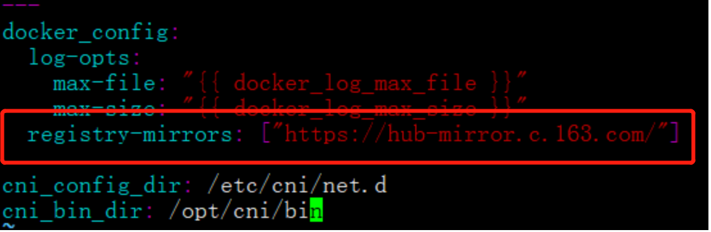
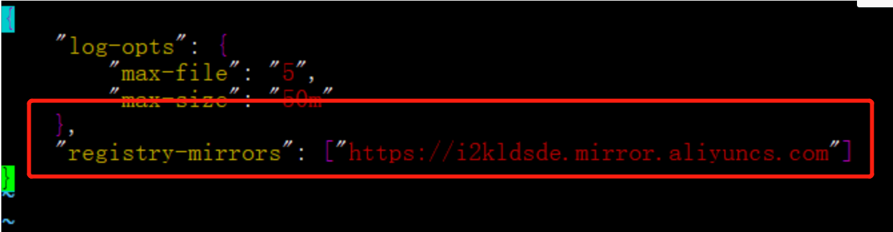
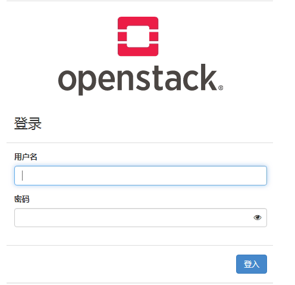

* [1、多节点在线安装步骤](#1%E5%A4%9A%E8%8A%82%E7%82%B9%E5%9C%A8%E7%BA%BF%E5%AE%89%E8%A3%85%E6%AD%A5%E9%AA%A4)
  * [1\.1  防火墙](#11-%E9%98%B2%E7%81%AB%E5%A2%99)
  * [1\.2  selinux](#12--selinux)
  * [1\.3  docker版本](#13--docker%E7%89%88%E6%9C%AC)
  * [1\.4 配置pip源](#14-%E9%85%8D%E7%BD%AEpip%E6%BA%90)
  * [1\.5 配置域名解析和免密登录](#15-%E9%85%8D%E7%BD%AE%E5%9F%9F%E5%90%8D%E8%A7%A3%E6%9E%90%E5%92%8C%E5%85%8D%E5%AF%86%E7%99%BB%E5%BD%95)
  * [1\.6 ansible版本](#16-ansible%E7%89%88%E6%9C%AC)
  * [1\.7  复制文件](#17--%E5%A4%8D%E5%88%B6%E6%96%87%E4%BB%B6)
  * [1\.8   密码文件](#18-%E5%AF%86%E7%A0%81%E6%96%87%E4%BB%B6)
  * [1\.9  修改globals文件[重要]](#19--%E4%BF%AE%E6%94%B9globals%E6%96%87%E4%BB%B6%E9%87%8D%E8%A6%81)
  * [1\.10  授信本节点](#110--%E6%8E%88%E4%BF%A1%E6%9C%AC%E8%8A%82%E7%82%B9)
  * [1\.11  配置单节点清单文件](#111--%E9%85%8D%E7%BD%AE%E5%8D%95%E8%8A%82%E7%82%B9%E6%B8%85%E5%8D%95%E6%96%87%E4%BB%B6)
  * [1\.12  配置docker 国内源并修改service文件](#112--%E9%85%8D%E7%BD%AEdocker-%E5%9B%BD%E5%86%85%E6%BA%90%E5%B9%B6%E4%BF%AE%E6%94%B9service%E6%96%87%E4%BB%B6)
  * [1\.13 安装bootstrap\-servers](#113-%E5%AE%89%E8%A3%85bootstrap-servers)
  * [1\.14  prechecks](#114--prechecks)
  * [1\.15  拉docker镜像](#115--%E6%8B%89docker%E9%95%9C%E5%83%8F)
  * [1\.16  进入实际部署](#116--%E8%BF%9B%E5%85%A5%E5%AE%9E%E9%99%85%E9%83%A8%E7%BD%B2)
  * [1\.17  验证部署](#117--%E9%AA%8C%E8%AF%81%E9%83%A8%E7%BD%B2)
  * [1\.18 访问登录页面](#118-%E8%AE%BF%E9%97%AE%E7%99%BB%E5%BD%95%E9%A1%B5%E9%9D%A2)

## 1、多节点在线安装步骤

> 这里仅供参考，大部分能已经集成在脚本里了，以总体步骤文档为准！

###       1.1  防火墙

```shell
[root@host01 ~]# systemctl stop  firewalld
[root@host01 ~]# systemctl disable  firewalld
```
###       1.2  selinux

  ```shell
[root@host01 ~]# getenforce
Enforcing
[root@host01 ~]# setenforce 0
[root@host01 ~]# getenforce
Permissive
[root@host01 ~]# vi /etc/selinux/config
  ```

```
# 命令修改
sed -i '/^SELINUX=/c SELINUX=disabled' /etc/selinux/config
```

###       1.3  docker版本

    wget -P /etc/yum.repos.d/ https://mirrors.aliyun.com/docker-ce/linux/centos/docker-ce.repo
```
dnf -y install docker-ce docker-ce-cli containerd.io
```

```
# 为了防止后面报错，还是降低了一下版本，保留，可以不执行，后面报错再说
yum downgrade --setopt=obsoletes=0 -y docker-ce-19.03.13-3.el7 docker-ce-cli-19.03.13-3.el7 containerd.io
```

###         1.4 配置pip源

```
mkdir ~/.pip
```

```
vi /root/.pip/pip.conf
```

```
[global]
index-url = https://mirrors.aliyun.com/pypi/simple/
[install]
trusted-host=mirrors.aliyun.com
```

###      1.5 配置域名解析和免密登录

> 注意ip写在前面,主机名写后面，hosts文件每个节点都要改！

```
 vim /etc/hosts
```

```
[root@host01 ~]# ping host01
PING host01 (192.168.40.146) 56(84) bytes of data.
64 bytes from host01 (192.168.40.146): icmp_seq=1 ttl=64 time=0.060 ms
64 bytes from host01 (192.168.40.146): icmp_seq=2 ttl=64 time=0.035 ms
```

```
[root@centos8-openstack-0 ~]# cat /etc/hosts
127.0.0.1   localhost localhost.localdomain localhost4 localhost4.localdomain4
::1         localhost localhost.localdomain localhost6 localhost6.localdomain6
192.168.1.202 host2
192.168.1.204 centos8-openstack-0
192.168.1.207 centos8-openstack-1
192.168.1.208 centos8-openstack-2
192.168.1.209 centos8-openstack-3
```

> 下面这一步只需要在部署节点执行就可以了！

```shell
# 在0上执行
ssh-keygen  # 一直回车就好
# 返回主目录，复制公钥到其他节点，注意自己也要认证，root后面要用主机名，不要用ip地址
cd ~
ssh-copy-id -i .ssh/id_rsa.pub root@centos8-openstack-0
ssh-copy-id -i .ssh/id_rsa.pub root@centos8-openstack-1
ssh-copy-id -i .ssh/id_rsa.pub root@centos8-openstack-3
```

```shell
# 可以直接ssh 主机名登录，不需要输入密码这一部即可设置成功
[root@centos8-openstack-0 ~]# ssh centos8-openstack-2
Activate the web console with: systemctl enable --now cockpit.socket
Last login: Tue Mar 16 02:13:56 2021 from 192.168.1.204
[root@centos8-openstack-2 ~]# exit
```

###   1.6 ansible版本

   ```
dnf install python3-devel libffi-devel gcc openssl-devel git python3-pip -y
   ```

```
# 参考多节点部署的
pip3.6 install -U pip
```

```
# 后面加了版本号，还是为了避免之前的报错。
pip3 install ansible==2.8.9   
```

```
pip3 install PyYAML --ignore-installed PyYAML #忽略安装的PyYAML，进行安装
pip3 install kolla-ansible
```

>后面装的时候果然遇到了版本不对的问题，要根据实际提示安装需要的版本。参考上面的1.3 解决

但是ansible

###  1.7  复制文件

```
[root@host01 share]# cp -r /usr/local/share/kolla-ansible/etc_examples/kolla /etc/
[root@host01 share]# cd /etc/kolla
[root@host01 kolla]# ll
total 36
-rw-r--r--. 1 root root 28012 Mar 11 03:28 globals.yml
-rw-r--r--. 1 root root  4987 Mar 11 03:28 passwords.yml
```

```
cp /usr/local/share/kolla-ansible/ansible/inventory/* /etc/kolla/
```

```
[root@host01 kolla]# ll
total 60
-rw-r--r--. 1 root root  9417 Mar 11 03:29 all-in-one
-rw-r--r--. 1 root root 28012 Mar 11 03:28 globals.yml
-rw-r--r--. 1 root root  9883 Mar 11 03:29 multinode
-rw-r--r--. 1 root root  4987 Mar 11 03:28 passwords.yml
```

> -  all-in-one      #安装单节点 openstack 的 ansible 自动安装配置文件
> -  multinode    #安装多节点 openstack 的 ansible 自动安装配置文件
> -  globals.yml  #openstack 部署的自定义配置文件
> - passwords.yml #openstack 中各个服务的密码

### 1.8   密码文件

执行下面命令，改密码

```
 kolla-genpwd
```

   修改

```
vim /etc/kolla/passwords.yml
```

```
keystone_admin_password: 123456
```

这是登陆dashboard，admin使用的密码，你可以根据自己需要进行修改

### 1.9  修改globals文件[重要]

> 仅供参考，multinode和all-one 的globals.yml不大一样，注意下。会提供模板，改ip地址，网卡名即可，其他不需要改。

- 如果是在vmware或者openstack嵌套环境，这里要选kvm，物理环境不需要改，直接默认。

```
# Valid options are [ qemu, kvm, vmware ]
nova_compute_virt_type: "qemu"
```

```
# Do not override this unless you know what you are doing.
openstack_release: "victoria"  # 这是版本，也不需要改。globals.yml已经写好了。
```

​     这一步很重要，哪些装，哪些不要装，配置文件都是注释的就是默认值。要根据实际情况改，保存一下这个文件。这次搭建用的NFS共享存储，把这个文件备份出来。使用了nfs共享存储。注意下配置文件。但后面不要用nfs存储了！

> nfs存储这里不详细介绍了。给的globals.yml文件都是以ceph存储为例的，这里看看就行。

```
mount 写的是本地目录，share写的是远程共享地址
```

### 1.10  授信本节点

> 一定要加root，偷懒没加root，一直提示ssh，unreachable，后来改了n个地方还是报错，重新认证了一下，再去deploy就好了。
>
> 多节点，在部署节点执行，每一台都要认证

 ```
ssh-keygen
cd ~
ssh-copy-id -i ~/.ssh/id_rsa.pub root@host01
ssh-copy-id -i ~/.ssh/id_rsa.pub root@host02
ssh-copy-id -i ~/.ssh/id_rsa.pub root@host03
 ```

这里只需要部署节点到各个节点能免密登录就可以了。

### 1.11  配置单节点清单文件

集群的时候，这个要根据实际情况修改。这个还简单一些，就是分配问题。

```
vim /etc/kolla/multinode
```

### 1.12  配置docker 国内源并修改service文件

  要配一下，不然后面拉镜像会很慢。

```
[root@localhost ~]# vim /usr/local/share/kolla-ansible/ansible/roles/baremetal/vars/main.yml 
registry-mirrors: ["https://hub-mirror.c.163.com/"]
```



```
vim /etc/docker/daemon.json
   "registry-mirrors": ["https://i2kldsde.mirror.aliyuncs.com"]
```

                                    

注意下格式不要写错，不然重启docker的时候会起不来。

```
systemctl daemon-reload
systemctl enable docker && systemctl restart docker
```

>  这个文件默认是没有的，需要手动创建.

[参考链接](https://blog.csdn.net/u013948858/article/details/79974796)

- 修改service文件

  这个文件，把原来的行注释掉，换成下面。ip改成本机ip地址，所有节点都要改。这个是为了使用zun。不然没法使用

  ```
  vim /usr/lib/systemd/system/docker.service
  ```

```
ExecStart=/usr/bin/dockerd  -H tcp://0.0.0.0:2375 -H unix://var/run/docker.sock --cluster-store etcd://192.168.1.202:2379
```

> 把原来的ExecStart注释掉，然后上面的复制进去，ip写本机ip地址。

```
systemctl daemon-reload
systemctl enable docker && systemctl restart docker
```

### 1.13 安装bootstrap-servers

 通过安装bootstrap-servers 把部署openstack所需要的依赖包都安装好

```
kolla-ansible -i /etc/kolla/multinode bootstrap-servers
```

  这一步会出现前面的ansible版本不兼容的错误，根据提示解决

### 1.14  prechecks

  这一步很重要，要根据实际报错，解决globals.yml 文件一些配置不对的地方，all-in-one场景下，配置文件可以保留下来。

```
kolla-ansible -i /etc/kolla/multinode prechecks
```

### 1.15  拉docker镜像

> 这一步网不好的话会很痛苦。网好，可以直接在线拉，网不好，有可能拉十几次都拉不下来。最好离线装（后来发现离线导入镜像，性能不好的话也要很长时间）

```
nohup kolla-ansible -i /etc/kolla/multinode pull &
```

> 注意把DNS改成114.114.114.114，这样网好一些。

### 1.16  进入实际部署

> 这一步是真正部署，它会根据globals.yml文件进行部署

```
nohup kolla-ansible -i /etc/kolla/multinode deploy &
```

### 1.17  验证部署

> 会产生鉴权文件

```
kolla-ansible -i /etc/kolla/multinode post-deploy
```

### 1.18 访问登录页面

   浏览器直接输入ip访问即可，然后走页面创建虚拟机，测试一下流程。

   


